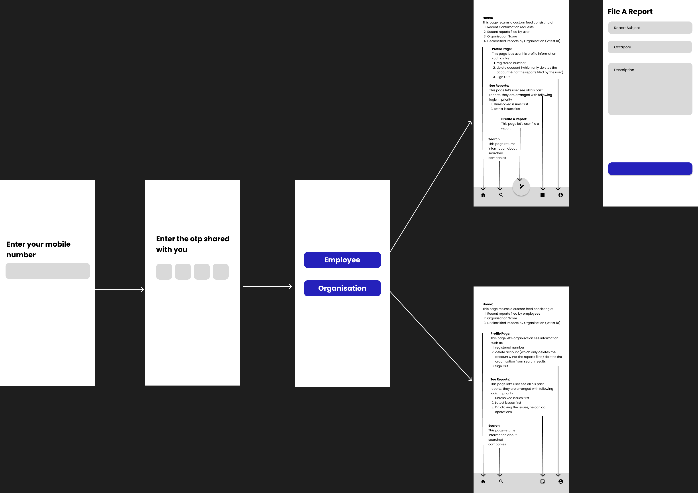

## Implementation Details

## Project Dependencies

```
dependencies:
  flutter:
    sdk: flutter

  cupertino_icons: ^1.0.2
  bottom_navy_bar: ^6.0.0
  firebase_core: ^2.8.0
  firebase_auth: ^4.3.0
  firebase_database: ^10.0.16
  cloud_firestore: ^4.4.5
  google_fonts: ^4.0.3
  google_sign_in: ^5.4.4
  get: ^4.6.5
  carousel_slider: ^4.2.1
  carousel_indicator: ^1.0.6
  flutter_svg: ^1.1.6

```

## Project Architecture

This project follows the GetX architecture pattern which consists of Models, Views, Controllers, and Services.

## Folder Structure

```
lib/
  |- controllers/
      |- auth_controller.dart
      |- search_view_controller.dart
      |- employee_view_controller.dart
      |- organisation_view_controller.dart
  |- models/
      |- app_user.dart
      |- report.dart
      |- organisation.dart
  |- services/
      |- firebase_auth_service.dart
      |- employee_services.dart
      |- organiation_service.dart
  |- views/
      |- components/
            |- buttons.dart
            |- headers.dart
      |- authentication_views/
            |- input_mobile_no.dart
            |- input_otp.dart
            |- account_type_selection_form.dart
            |- organisation_information_form.dart
      |- common_views/
            |- search.dart
      |- employee_views/
            |- feed.dart
            |- profile.dart
            |- reports.dart
      |- organisation_views/
            |- feed.dart
            |- reports.dart
            |- profile.dart
      |- landing_view.dart
  |- utils/
      |- size_util.dart
      |- formatters.dart
      |- validators.dart
      |- theme.dart
  |- main.dart

```

## Models

### User Model
```
AppUser {
    uid: str,
    acc_type : str [AMB | EMP | ORG],
    is_profile_complete : bool,
    database_document_id : str
}
```


### Organisation User Model
```
Organisation extends AppUser {
    organisation_name: str,
    organisation_desc: str,
    website: str,
    counts: {
        registered_sexual_harassment: int,
        resolved_sexual_harassment : int,
        registered_discrimination: int,
        resolved_discrimination: int
    },
    score : int
}
```

### Report Model
```
Report{
    report_id : str, // will be document id
    victim_uid: str, // will be uid of firebase user
    subject : str,
    catagory: str,
    description: str,
    created_on : DateTime,
    status: str [received | working | waiting_for_confirmation | closed],
    activity_log : [
        {
            activity_name : [received | working | waiting_for_confirmation | closed],
            activity_timestamp : DateTime
        }
    ],
    communication : [
        {
            sender_uid: str,
            content: str,
            timestamp: DateTime
        }
    ],
    visibility: str [public | private]
}
```


## Controllers
1. AuthController: Handles the authentication logic for the app using Firebase Authentication.

```
class AuthenticationController extends GetxController {
    Rx<AppUser?> user = Rx<AppUser?>(null);

    Future handleMobileNumberInput(String mobileNo);
    Future handleOTPInput(String otp);
    Future handleAccountTypeSelection(String type);
    Future handleOrganisationRegistration(
        String name, 
        String desc, 
        String website, 
        String address
    );
    Future handleSignOut();
}
```

2. EmployeeViewController: Handles the employee related operations such as showing custom feed, filing report, resolution confirmation etc.

```
class EmployeeViewController extends GetxController {
    Rx<List<Report>> reportsFiled;

    Future handleFileAReport(
        String title, 
        String catagory,
        String description,
    );
    Future handleReplyToMessege(
        Report report,
        String content
    );
    Future handleConfirmResolved(
        Report report
    );
}
```

3. OrganisationController: Handles the organisation related operations such as changing name, adding website, view & resolve issues, make cases public etc.

```
class OrganisationViewController extends GetxController {
    Rx<List<Report>> reportsFiled;

    Future handleReplyToMessege(
        Report report,
        String content
    );

    Future handleMarkAsSeen(
        Report report
    );

    Future handleMarkAsResolved(
        Report report
    );
}
```

4. SearchController: Handles the search accross organisation
```
class SearchResultController extends GetxContrller {
    Rx<List<Organisation>> searchResult;

    Future handleUpdateSearchTerm(String query);
}
```

## Services
1. FirebaseService: Handles the communication with Firebase Authentication and Cloud Firestore.

## Views


## Overall Flow


## Jobs

1. Initialize the flutter project & create a git repo.
2. Add dependancies and configure Android & iOS code.
3. Complete Authentication View, Authentication Controller.
```
Here onwards team will be divided into two groups one will handle employee operations another will handle organisation operations
```
4. Implement EmployeeController methods handleFileReport.
5. Implement OrganisationController methods handleMarkAsSeen, handleMarkAsResolved.
6. Implement Employee Controller handleReplyToMessege.
7. Implement Organisation Controller handleReplyToMessege.
8. Implement Employee Feed
9. Implement Organisation Feed
10. Implement Search Controller and View
11. Build, Test, Debug Repeat